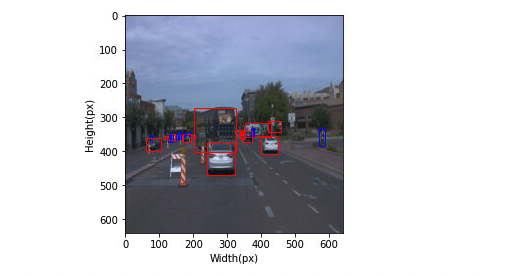

## Submission Template
Rozda Askari
9/16/2022

### Project overview
This section should contain a brief description of the project and what we are trying to achieve. Why is object detection such an important component of self driving car systems?

The goal of this 1st project is to demonstrate how the basics of the machine learning workflow come together to help a user tackle real world problems. Generally, to test fundamentals around data exploration, data pipelines, and creating models. More specfically, we'll be starting with tensorflow records from the waymo dataset and from data points outlined in those records we'll be able to outline respective bounding boxes around images to then pass through a model built using the TensorFlow object detection API.

Object detection is at the core of self-driving car systems - a vehicle system needs to know what surrounds it in an environement as that will dicate its actions in the world. 

### Set up
This section should contain a brief description of the steps to follow to run the code for this repository.

Note: project run in udacity provided workspace 
Steps to recreate involve from this workspace:
1) Download image tfrecords from Waymo dataset then split into respective train, test, and validation sets (5 for testing, 85 for training, and 10 for validation )
2) Implement display images in playbook and explore dataset and make observations
3) Download pretrained SDD Resnet 50 640x640 model and familiarize self with respective config file
4) Edit configuration to point to training and validation data points and call this file pipeline_new.config
5) Run tensorboard.main to start monitoring model training. Will be running in notebook on localhost port 6006
6) Train model using the pipeline_new.config which points to respective data used for experiment to see how well model performs on this data (lowered total # steps in config to not use up compute time)
6) Run evalulation process
7) These results can be a baseline that we improve upon with different augmentation strategies on the data
8) Searched preprocessor.proto file to look at list of about 40 augmentation strategies to choose from.
9) Run model training and eval again with new configuration. 
10) Export trained model with configurations that I like
11) Run inference_video.py that creates videos of model inferences.

### Dataset
#### Dataset analysis
This section should contain a quantitative and qualitative description of the dataset. It should include images, charts and other visualizations.

I implemented the `display_instances(batch)` function to display 10 images. The data has a varied set of pictures from night/day and bright/foggy conditions. Some picture have a mix of cars, pedestrians, and bikers from near and close distances. This variability is helpful in respect to having many examples that could be representative of real life.  The following is a sample of the shown images. 
 

When exploring the data further I was able to find this distribution of cars, to pedestrians to bikers. 

#### Cross validation
This section should detail the cross validation strategy and justify your approach.

Cross validation is a tactic to help make sure that models do not overfit, and also generalize well across new examples. This workspace had already split up the test, validation, and training. It was close to a 85% training, 10% testing, and 5% validation split. 

### Training
#### Reference experiment
This section should detail the results of the reference experiment. It should includes training metrics and a detailed explanation of the algorithm's performances.

Reference expirement did not perform well and animation revealed that it performed very poorly. Included example metrics from reference experiment. The training had many fluctiations in the losses. For the reference model, all losses start at high value and then decrease steadily to around the .5 classification loss range, 0.8 localization loss. The total loss converges near 3.

#### Improve on the reference
This section should highlight the different strategies you adopted to improve your model. It should contain relevant figures and details of your findings.

In order to improve this experiment further I added the following augmentations from the proto file. If more compute time was available I would have raised steps taken to 25000 rather than 2500. I added additional augmentations around adjusted contrast and brightness to make sure that situations with dim/no light and very bright situations are also brought into considerations into the training phase.  

  data_augmentation_options {
    random_horizontal_flip {
    	probability: 0.5 
    }
  }
  data_augmentation_options {
    random_crop_image {
      min_object_covered: 0.0
      min_aspect_ratio: 0.75
      max_aspect_ratio: 3.0
      min_area: 0.75
      max_area: 1.0
      overlap_thresh: 0.0
    }
    
    data_augmentation_options {
      random_adjust_contrast {
    	  min_delta: 0.9 
        max_delta: 1.5
    }
  }
  data_augmentation_options {
    random_adjust_brightness {
    	max_delta: 0.5 
    }
  }

## Model Improvements
Another approach to improve the the model is experiemnt with different optimizers. The one used in this experiment is the Momentum optimizer. Research into the subject also shows that other potentials candidates for computer vision projects comprise of: Adam, RMSprop, AdaGrad, SGD, SGD with Momentum, LARS, and Adam W. Each one has its pros and cons re: convergance to sharp minima but if memory was not a problem I would attempt to use the Adam and AdamW. As the Adam optimizer seems to do well when features are limited and in this case it would be great for Bikes, and pedestrians which are included in much smaller rations in this example. 